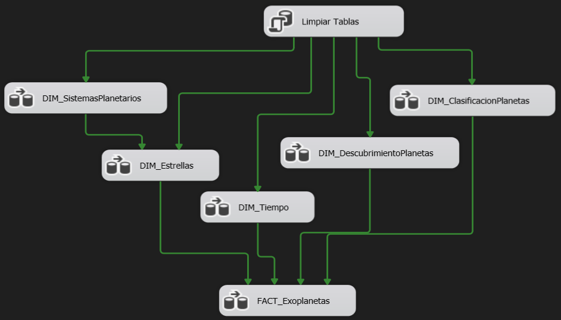
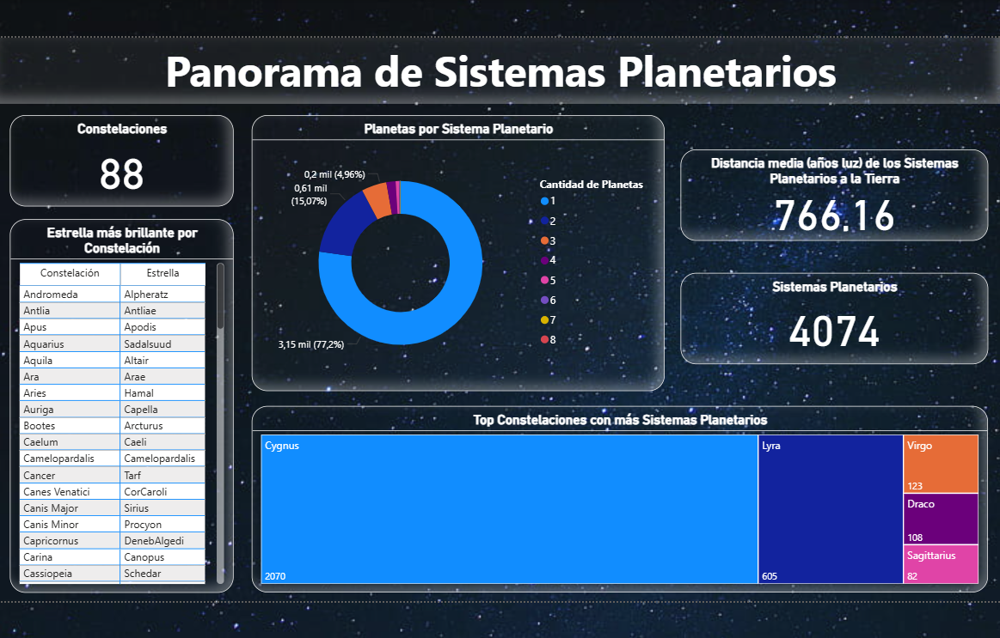
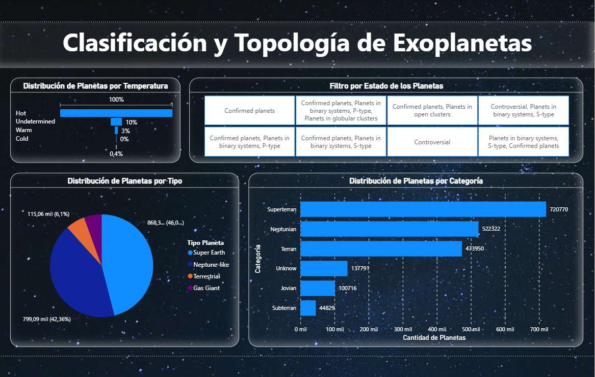
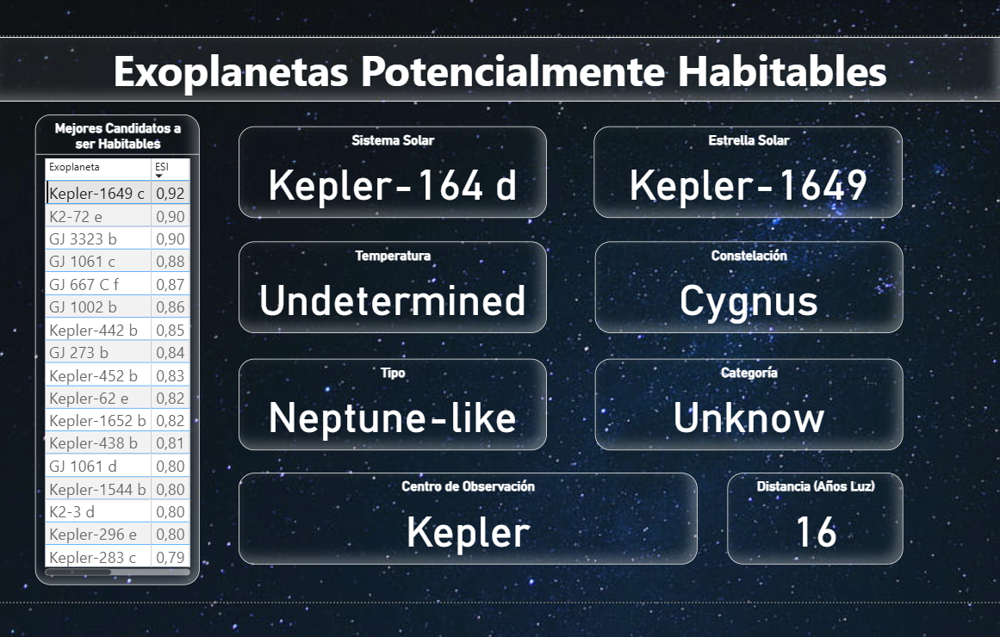

# Proyecto BI: Análisis de Exoplanetas y Sistemas Planetarios

Este proyecto implementa un flujo completo de **Business Intelligence (BI)** para analizar información sobre **exoplanetas y sistemas planetarios**.  

Integra **fuentes de datos, procesos ETL, modelado de Data Warehouse (DW), cubos OLAP y visualizaciones en Power BI**.  

---

## Estructura del Proyecto

```
Proyecto-BI-Sistemas-Planetarios
 ┣ 📂 OrigenDatos
 ┃ ┣ PSCompPars_2025.09.03_17.54.48.csv
 ┃ ┣ SistemasPlanetarios.xlsx
 ┣ 📂 SQL
 ┃ ┣ 01_Creacion_BD_Primaria.sql
 ┃ ┣ 02_Creacion_DW.sql
 ┃ ┣ 03_Carga_Dimensiones_IS.sql
 ┃ ┣ 04_Consultas_Cubo_AS.sql
 ┣ 📂 Knime
 ┃ ┗ SistemasPlanetarios.knwf
 ┣ 📂 IntegrationServices
 ┃ ┗ 📂 SistemasPlanetarios
 ┣ 📂 AnalysisServices
 ┃ ┗ 📂 CuboSistemasPlanetarios
 ┣ 📂 PowerBI
 ┃ ┗ SistemasPlanetrios.pbix
 ┣ 📂 Screenshots
 ┃ ┣ Knime.png
 ┃ ┣ IntegrationServicesFlow.png
 ┃ ┣ CuboAnalisysServices.png
 ┃ ┣ PowerBI_.sql
```

---

## 1. Base de Datos OLTP (SQL Server)

- Base de datos: `SistemasPlanetarios`  
- Se cargó información de un dataset original en **Excel** usando **KNIME**.  
- Tablas principales:  
  - `SistemasPlanetarios`,  
  - `Estrellas`  
  - `Exoplanetas`  
  - `Constelaciones`  
  - `MetodosDescubrimiento`
  - `Telescopios`
  - `LocacionesDescubrimiento`
  - `ClasificacionTemperatura`
  - `TipoPlanetas`
  - `CategoriaPlanetas`
  - `FacilidadDescubrimiento`  

Scripts: `SQL/01_Creacion_BD_Primaria.sql`  

---

## 2. ETL con KNIME

- **Objetivo:** Cargar datos desde Excel a la base de datos primaria (`SistemasPlanetarios`).  
- Flujo implementado:  
  - `Read Excel Sheet Names` (lectura de múltiples pestañas).  
  - `Table Row to Variable Loop Start` para recorrer las hojas.
  - `Excel Reader` (para obtener los datos por pestaña).
  - `Missing Value` (para corregir filas con datos nulos).
  - `Microsoft SQL Server Connection` para conectar con la base de datos. 
  - `DB Insert` para cargar las tablas en SQL Server.
  - `Variable Loop End` para cierre del loop.  

Workflow en: `Knime/SistemasPlanetarios.knwf`

**Captura del flujo en KNIME:**  


---

## 3. Data Warehouse (DW)

- Base de datos: `SistemasPlanetariosDW`  
- Modelo **Star Schema**:  

**Dimensiones:**
- `DIM_SistemasPlanetarios`
- `DIM_Estrellas`
- `DIM_DescubrimientoPlanetas`
- `DIM_ClasificacionPlanetas`
- `DIM_Tiempo`

**Tabla de hechos:**
- `FACT_Exoplanetas`

Scripts en: `SQL/02_Creacion_DW.sql`

---

## 4. Carga con Integration Services (SSIS)

- Se crearon **Data Flow Tasks** en SSIS para poblar las dimensiones y la tabla de hechos.  
- Fuente: `SistemasPlanetrios`  
- Destino: `SistemasPlanetariosDW`  
- Paquete principal: `IntegrationServices/SistemasPlanetarios.sln`

Añadir captura aquí de la carpeta CaputurasPantalla

**Captura del flujo en SSIS:**  


---

## 5. Cubo OLAP (SSAS)

- Cubo: `Sistemas Planetarios DW`  
- Procesado sobre `SistemasPlanetariosDW`  
- Dimensiones expuestas:  
  - Tiempo  
  - Sistemas Planetarios  
  - Estrellas  
  - Clasificación de Planetas  
  - Descubrimiento de Planetas

Archivo: `AnalysisServices/SistemasPlanetarios.sln`

**Captura del Cubo en SSAS:**  


---

## 6. Dashboard en Power BI

Se desarrollaron **5 dashboards interactivos**, cada uno enfocado en un aspecto distinto del análisis de los exoplanetas:

1. **Distribución de Sistemas Planetarios en la Galaxia**  
   - Pestaña: `Sistemas Planetarios`  
   - Indicadores:  
     - Nº de constelaciones  
     - Estrella más brillante por constelación  
     - Distribución de planetas por sistema  
     - Distancia media de sistemas a la Tierra  
     - Top constelaciones con más sistemas planetarios  

**"Sistemas Planetarios" Dashboard:**  


2. **Clasificación y Características de Exoplanetas**  
   - Pestaña: `Clasificación de Planetas`  
   - Indicadores:  
     - Distribución por temperatura  
     - Estado de los planetas (confirmados, controversiales, etc.)  
     - Distribución por tipo (Super Earth, Gas Giant, etc.)  
     - Distribución por categoría  

 **"Clasificacion PLanetas" Dashboard:**  


3. **Centros y Técnicas de Descubrimiento de Exoplanetas**  
   - Pestaña: `Descubrimiento`  
   - Indicadores:  
     - Ubicación de centros y telescopios en el mundo  
     - Técnica de descubrimiento más eficiente  
     - Top telescopios cazadores de planetas  
     - Evolución temporal de descubrimientos  

 **"Descubrimientos" Dashboard:**  


4. **Propiedades Físicas y Orbitales de Exoplanetas**  
   - Pestaña: `Propiedades Exoplanetas`  
   - Indicadores:  
     - Relación temperatura de la estrella vs período orbital  
     - Relación radio vs masa de planetas  
     - Distribución de radios planetarios por clasificación  

 **"Propiedades Exoplanetas" Dashboard:**  


5. **Exoplanetas Potencialmente Habitables**  
   - Pestaña: `Planetas Habitables`  
   - Indicadores:  
     - Ranking de exoplanetas con mejor índice ESI  
     - Detalle por planeta seleccionado (estrella, constelación, tipo, categoría, distancia, etc.)  

 **"Planetas Habitables" Dashboard:**  


Archivo: `PowerBI/SistemasPlanetarios.pbix` 

**Dashboard "Sistemas Planetarios":**  


---

## Tecnologías Usadas

- **SQL Server Management Studio (SSMS)** – Modelado OLTP y DW  
- **KNIME** – ETL desde Excel hacia SQL Server  
- **SQL Server Integration Services (SSIS)** – Carga de DW  
- **SQL Server Analysis Services (SSAS)** – Cubo OLAP  
- **Power BI** – Visualizaciones interactivas  

---

## Objetivo del Proyecto

Este proyecto demuestra el ciclo completo de **Business Intelligence** aplicable a cualquier dominio:  

- Extracción de datos  
- Transformación y limpieza  
- Modelado de Data Warehouse
- Implementación de cubos OLAP  
- Creación de dashboards ejecutivos
  
---

## Idiomas

Este README está disponible en:  
- [English](README.md)  
- [Español](README.es.md)
