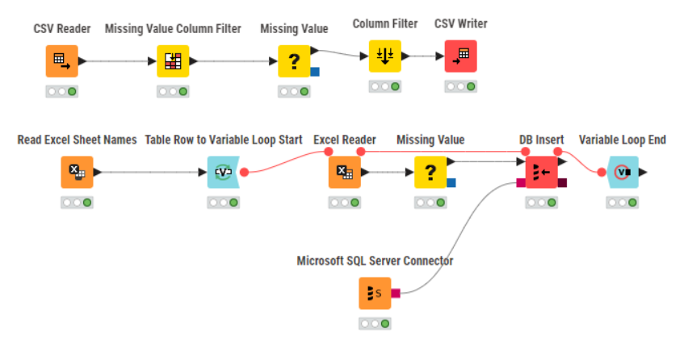
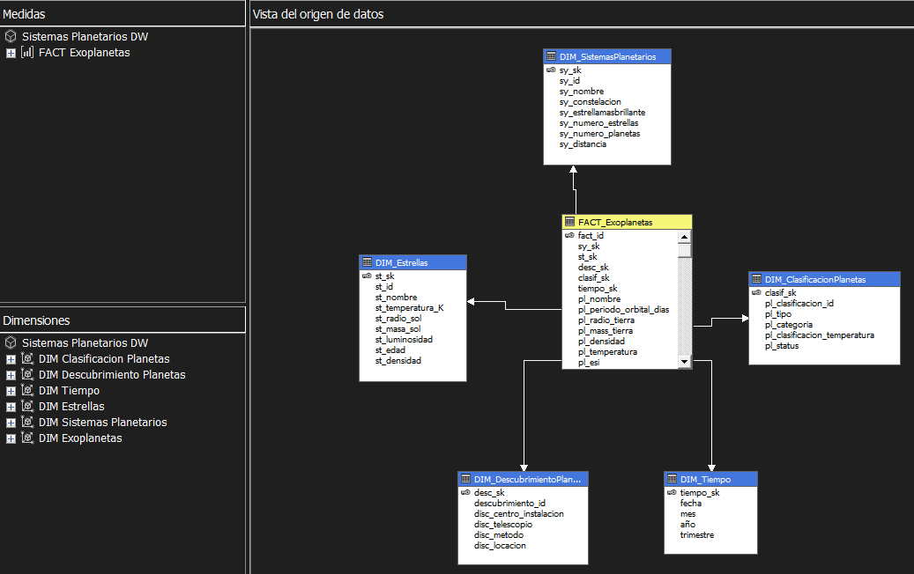
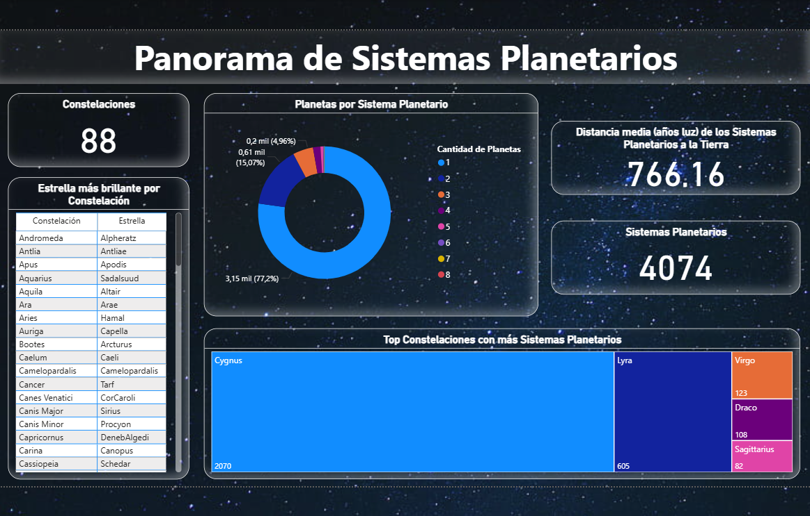
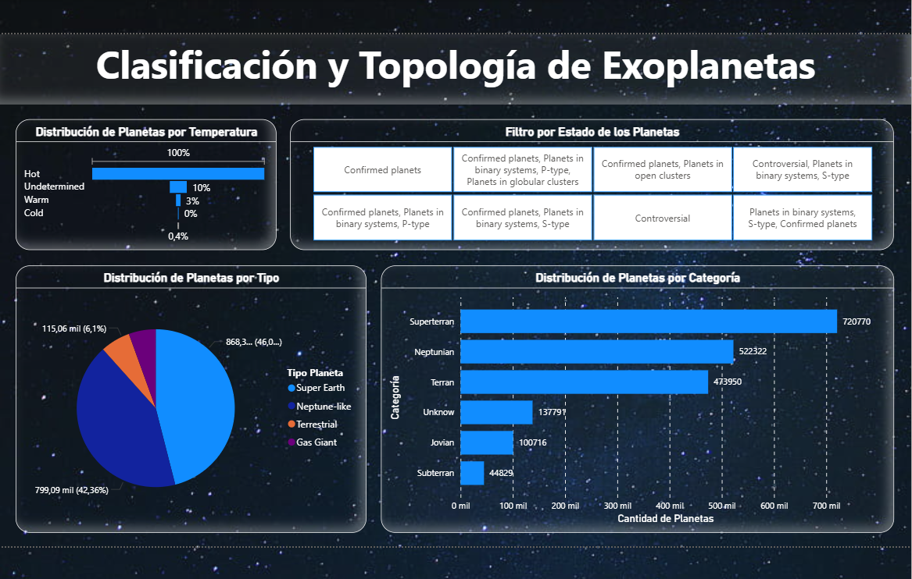
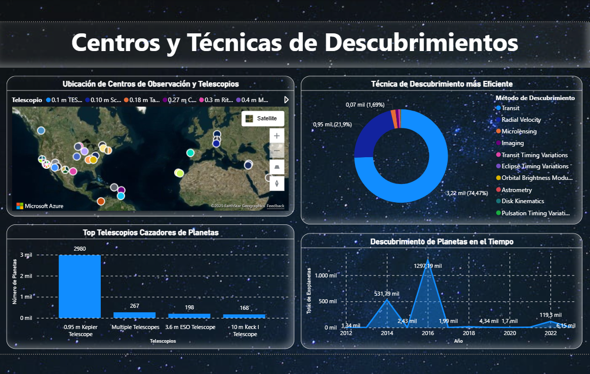
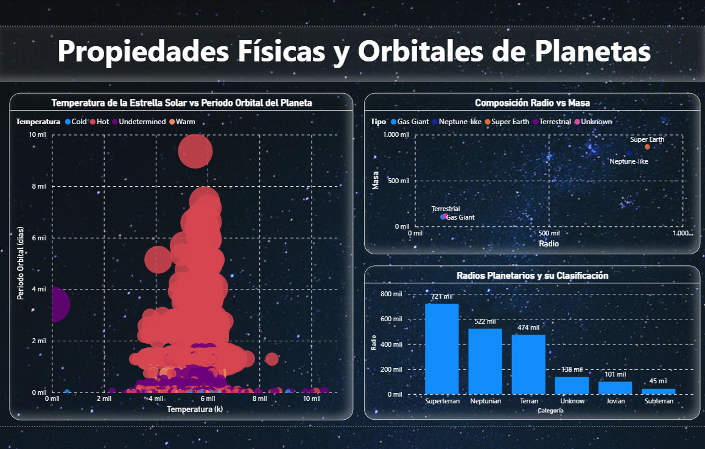
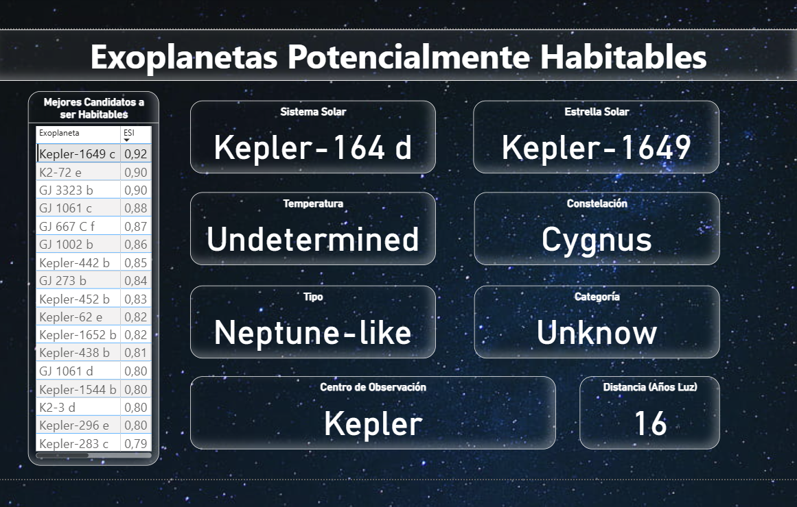

# BI Project: Analysis of Exoplanets and Planetary Systems

This project implements a complete **Business Intelligence (BI)** pipeline to analyze information about **exoplanets and planetary systems**.  

It integrates **data sources, ETL processes, Data Warehouse modeling, OLAP cubes, and Power BI dashboards**.  

---

## Project Structure

```
Proyecto-BI-Sistemas-Planetarios
 ┣ 📂 OrigenDatos
 ┃ ┣ PSCompPars_2025.09.03_17.54.48.csv
 ┃ ┣ SistemasPlanetarios.xlsx
 ┣ 📂 SQL
 ┃ ┣ 01_Creacion_BD_Primaria.sql
 ┃ ┣ 02_Creacion_DW.sql
 ┃ ┣ 03_Carga_Dimensiones_IS.sql
 ┃ ┣ 04_Consultas_Cubo_AS.sql
 ┣ 📂 Knime
 ┃ ┗ SistemasPlanetarios.knwf
 ┣ 📂 IntegrationServices
 ┃ ┗ 📂 SistemasPlanetarios
 ┣ 📂 AnalysisServices
 ┃ ┗ 📂 CuboSistemasPlanetarios
 ┣ 📂 PowerBI
 ┃ ┗ SistemasPlanetrios.pbix
 ┣ 📂 Screenshots
 ┃ ┣ Knime.png
 ┃ ┣ IntegrationServicesFlow.png
 ┃ ┣ CuboAnalisysServices.png
 ┃ ┣ PowerBI_.sql
```

---

## 1. OLTP Database (SQL Server)

- Database: `SistemasPlanetarios`  
- Data loaded from an **Excel dataset** using **KNIME**.  
- Main tables:  
  - `SistemasPlanetarios`,  
  - `Estrellas`  
  - `Exoplanetas`  
  - `Constelaciones`  
  - `MetodosDescubrimiento`
  - `Telescopios`
  - `LocacionesDescubrimiento`
  - `ClasificacionTemperatura`
  - `TipoPlanetas`
  - `CategoriaPlanetas`
  - `FacilidadDescubrimiento`  

Scripts: `SQL/01_Creacion_BD_Primaria.sql` 

---

## 2. ETL with KNIME

- **Goal:** Load Excel data into the primary database (`SistemasPlanetarios`).  
- Workflow steps:  
  - `Read Excel Sheet Names` (multi-tab reading).  
  - `Table Row to Variable Loop Start` (loop through multiple sheets).
  - `Excel Reader` (to retrieve data by tab).
  - `Missing Value` (to correct rows with null data).
  - `Microsoft SQL Server Connection` to connect to the database.
  - `DB Insert` to load data into SQL Server.
  - `Variable Loop End` to end the loop.
 
Workflow: `Knime/SistemasPlanetarios.knwf`  

**KNIME flow screenshot:**  


---

## 3. Data Warehouse (DW)

- Database: `SistemasPlanetariosDW`  
- **Star Schema Model**:  

**Dimensions:**
- `DIM_SistemasPlanetarios`
- `DIM_Estrellas`
- `DIM_DescubrimientoPlanetas`
- `DIM_ClasificacionPlanetas`
- `DIM_Tiempo`

**Fact Table:**
- `FACT_Exoplanetas` 

Scripts en: `SQL/02_Creacion_DW.sql`

---

## 4. Data Loading with SSIS (Integration Services)

- Built **Data Flow Tasks** in SSIS to populate dimensions and fact table.  
- Source: `SistemasPlanetrios` (OLTP)  
- Target: `SistemasPlanetariosDW` (DW)  
- Main package: `IntegrationServices/SistemasPlanetarios.sln`  

**SSIS data flow screenshot:**  


---

## 5. OLAP Cube (SSAS)

- Cube: `Sistemas Planetarios DW`  
- Based on: `SistemasPlanetariosDW`   
- Exposed dimensions:  
  - Tiempo  
  - Sistemas Planetarios  
  - Estrellas  
  - Clasificación de Planetas  
  - Descubrimiento de Planetas 
 
File: `AnalysisServices/SistemasPlanetarios.sln`

**SSAS Cube screenshot:**  


---

## 6. Power BI Dashboards

A set of **5 interactive dashboards** was created, each focusing on a specific aspect of planetary and exoplanetary analysis:

1. **Distribution of Planetary Systems in the Galaxy**  
   - Tab: `Sistemas Planetarios`  
   - Metrics:  
     - Number of constellations  
     - Brightest star by constellation  
     - Planets per planetary system  
     - Average system distance to Earth  
     - Top constellations with more systems

**"Sistemas Planetarios" Dashboard:**  


2. **Exoplanet Classification and Characteristics**  
   - Tab: `Clasificación de Planetas`  
   - Metrics:  
     - Distribution by temperature  
     - Discovery status (confirmed, controversial, etc.)  
     - Distribution by planet type (Super Earth, Gas Giant, etc.)  
     - Distribution by planet category
    
 **"Clasificacion PLanetas" Dashboard:**  


3. **Discovery Centers and Detection Techniques**  
   - Tab: `Descubrimiento`  
   - Metrics:  
     - Map of telescopes and observation centers  
     - Most efficient discovery technique  
     - Top telescopes detecting planets  
     - Planet discoveries over time

 **"Descubrimientos" Dashboard:**  


4. **Physical and Orbital Properties of Exoplanets**  
   - Tab: `Propiedades Exoplanetas` 
   - Metrics:  
     - Stellar temperature vs orbital period  
     - Planetary radius vs mass  
     - Planetary radii distribution by classification
    
 **"Propiedades Exoplanetas" Dashboard:**  


5. **Potentially Habitable Exoplanets**  
   - Tab: `Exoplanetas Potencialmente Habitables` 
   - Metrics:  
     - Ranking of exoplanets with the highest ESI  
     - Detailed profile by selected planet (star, constellation, type, category, distance, etc.)
    
 **"Planetas Habitables" Dashboard:**  


File: `PowerBI/SistemasPlanetarios.pbix` 

---

## Technologies Used

- **SQL Server Management Studio (SSMS)** – OLTP & DW modeling  
- **KNIME** – ETL from Excel to SQL Server  
- **SQL Server Integration Services (SSIS)** – DW loading  
- **SQL Server Analysis Services (SSAS)** – OLAP cube  
- **Power BI** – Interactive dashboards  

---

## Project Objective

This project demonstrates the full **Business Intelligence cycle**, applicable to any domain:  

- Data extraction  
- Transformation and cleaning  
- Data Warehouse modeling  
- OLAP cube design  
- Executive dashboards

---

## Multilanguage

This README is available in:  
- [English](README.md)  
- [Español](README.es.md)
